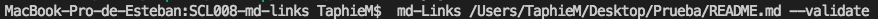

# Markdown Links

## Preámbulo

[Markdown](https://es.wikipedia.org/wiki/Markdown) es un lenguaje de marcado
ligero muy popular entre developers. Es usado en muchísimas plataformas que
manejan texto plano (GitHub, foros, blogs, ...), y es muy común
encontrar varios archivos en ese formato en cualquier tipo de repositorio
(empezando por el tradicional `README.md`).

Estos archivos `Markdown` normalmente contienen _links_ (vínculos/ligas) que
muchas veces están rotos o ya no son válidos y eso perjudica mucho el valor de
la información que se quiere compartir.

Dentro de una comunidad de código abierto, nos han propuesto crear una
herramienta usando [Node.js](https://nodejs.org/), que lea y analice archivos
en formato `Markdown`, para verificar los links que contengan y reportar
algunas estadísticas.


## Diagrama de Flujo


### Documentación ténica de la librería
Las herramientas y dependencias implementadas para la construcción de esta Librería fueron las siguientes:

| **Lenguaje**
| ------------------------------
| JavaScript ECMAScript 6
| **Ejecución**
| Node  
| **Dependencias y módulos NPM**
| File System
| node-Fetch
| Path
| markdown-link-extractor
| **Testing**
| Jest


## Instalación de la librería

Podemos instalar directamente desde GitHub con el comando:

`npm install taphie-md-links`

Sí se quiere implementar globalmente. Puede instalarse via:

`npm install --global taphie-md-links`

ó

`npm i --global taphie-md-links`

Este módulo incluye ejecutable y una interfaz que podamos importar con require para usarlo programáticamente.

### Guía de uso
**CLI (Command Line Interface - Interfaz de Línea de Comando)**

El ejecutable de nuestra aplicación debe poder ejecutarse de la siguiente
manera a través de la terminal:

`md-links <path-to-file> [options]`

Ejemplo:


Resultado:


El comportamiento por defecto no valida si las URLs responden ok o no, solo debe identifica el archivo markdown (a partir de la ruta que recibe como argumento), analizar el archivo Markdown e imprimir los links que vaya encontrando, junto con la ruta del archivo donde aparece y el texto que hay dentro del link (truncado a 50 caracteres).


#### Options

##### `--validate`

Si pasamos la opción `--validate`, el módulo debe hacer una petición HTTP para
averiguar si el link funciona o no. Si el link resulta en una redirección a una
URL que responde ok, entonces consideraremos el link como ok.

Ejemplo:



Resultado:


Vemos que el _output_ en este caso incluye la el código del estatus de
la URL, así como un texto que indica la respuesta recibida a la petición HTTP a dicha
URL.

**Para esta primera versión solo esta implemnetada la opción validate, sin embargo en futuras versiónes se espera agregar la opción stats. A continuación se explica la funcionabilidad que se espera obtener de esta.**

##### `--stats`

Si pasamos la opción `--stats` el output (salida) será un texto con estadísticas
básicas sobre los links.

```sh
$ md-links ./some/example.md --stats
Total: 3
Unique: 3
```

También podemos combinar `--stats` y `--validate` para obtener estadísticas que
necesiten de los resultados de la validación.

```sh
$ md-links ./some/example.md --stats --validate
Total: 3
Unique: 3
Broken: 1
```

#### Autor
Stephanie Mayen

